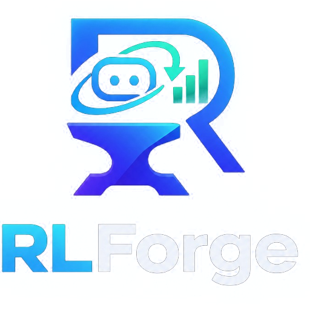

<p align="center">
  
</p>

<p align="center"><b>DevTools for reinforcement-learning environments and agents, inside VS Code.</b></p>

RLForge lets you watch your agent play, test your Gymnasium environment, fuzz it for bugs and replay any failure step
by step, all in an editor tab. It needs no code changes, no wrappers, no callbacks and no browser dashboard.

## Requirements

- Python 3.9+ with `gymnasium` installed (RLForge uses the interpreter selected in the Python extension, or
  `python` / `py -3` on PATH; override with the `rlforge.pythonPath` setting).
- Optional: `stable-baselines3` to watch trained models, and `pygame` for rendered environments.

```bash
pip install "gymnasium[classic-control]" stable-baselines3
```

If something is missing, RLForge shows the exact `pip install` command and can run it for you.

## Getting started

Open any Python project and use one of these:

- **Explorer → RLForge**: Open Agent Arena · Test Environment · Fuzz Environment · Episode Replays.
- The **Watch · Test · Fuzz · Inspect** CodeLens above every `gym.make(...)` call and custom `gym.Env` class.
- Right-click a Stable-Baselines3 `.zip` in the Explorer → **Watch Agent in RLForge**.
- The **RLForge** icon in the activity bar, which lists the environments, models and training scripts found in your
  project.

## Features

### 🎮 Agent Arena

A live rendered environment with play / pause / step / step back / reset and 0.1x–10x speed. You can scrub a reward
timeline, and a step debugger shows **state → action → reward → next state** for every decision. For SB3 models it
also shows the action probabilities, entropy, V(s) and Q-values. Every step is checked for NaN/Inf, observations
outside the declared space and exploding values. Exceptions in `step()` / `reset()` link straight to the line in
your code.

Agents can be a random policy or any Stable-Baselines3 model (PPO, A2C, DQN, SAC, TD3, DDPG; the algorithm is
detected automatically).

### 🩺 Environment health check

One click runs Gymnasium's `check_env`, plus checks it doesn't cover:

- the reset/step contract and seeding;
- **determinism** (same seed + actions → same trajectory);
- crashes, NaN/Inf, and space violations;
- exploding values and termination;
- the reward signal, rendering and throughput.

The score comes straight from the checklist. Every failure comes with the seed and action sequence that trigger it,
and a **Replay in Arena** button. When RLForge finds a new custom environment in your project, it offers to run a
health check.

### 🧨 Fuzzer

The fuzzer runs 100–10,000 seeded episodes with uniform or boundary-biased (extreme) actions. Failures are:

- grouped by cause;
- verified to reproduce;
- **shrunk to the shortest failing action sequence**;
- replayable in one click, with the Arena pausing on the failing step.

### 🎥 Episode replay

Turn on **⏺ Record** in the Arena, or press **💾 Save episode**, to keep episodes in `.rlforge/episodes/`. Replays
re-simulate from the seed and actions and show the agent's recorded decisions. If the environment isn't
deterministic, RLForge flags the exact step where a replay diverges from the recording.

### 🎯 Reward detective

Shows the reward distribution, sparsity, the balance of positive and negative rewards, distinct values and returns
under a random policy. Plain-language warnings point out sparse, constant, huge or NaN rewards.

### 🔍 Environment Inspector

Shows observation and action spaces with feature labels, bounds, episode limits, render modes, the wrapper stack and
a link to the source.

## Custom environments

RLForge supports registered ids (`CartPole-v1`, `ALE/...`, your own `gym.register` ids) and environment classes
straight from a file, as `path/to/env.py:MyEnv`. The project scan finds these for you.

## Settings

| Setting | Description |
| --- | --- |
| `rlforge.pythonPath` | Python interpreter for the engine (default: the Python extension's interpreter). |
| `rlforge.defaultSeed` | Seed of the first episode (episode N uses seed + N − 1). |
| `rlforge.autoReset` | Start a new episode automatically when one ends. |
| `rlforge.codeLens.enabled` | Show the Watch / Test / Fuzz / Inspect CodeLens. |

## Privacy

RLForge runs entirely on your machine. It has no telemetry and makes no network requests of its own; the only
exception is a `pip install` you explicitly click. The Python engine is a local process that talks to the editor
over stdin/stdout.

## Development

```bash
npm install && npm --prefix webview-ui install
npm start                      # build, package the .vsix and install it into Cursor / VS Code
python engine/tests/smoke_test.py [path/to/model.zip]
```

Code layout:

- `src/`: the extension host.
- `webview-ui/`: the React UI.
- `engine/rlforge_engine/`: the Python engine.
- `examples/`: sample environments and a training script.

[Report an issue](https://github.com/tanishbhandari11t/RLForge/issues) · MIT License
